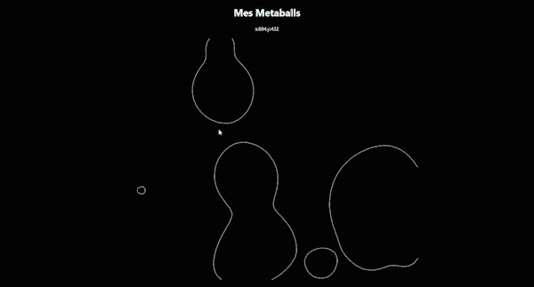

<h1>Metaballs</h1>

Display some weird shape, it uses some dichotomies and other stuff
It was cool to make

<h3>Needs</h3>

Installation 
<code> ~$ npm install </code> 
Then you launch the development mode 
<code> ~$ npm start</code> 

<h3>Result</h3>

